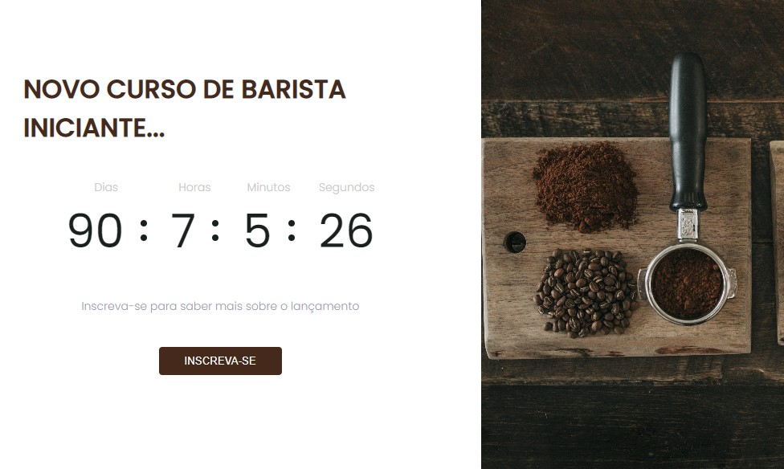

<h1 align="center">
   <p>Coffe-countdown</p>
</h1>

<p align="center">
 <a href="#tecnologias">Tecnologias</a> •
 <a href="#layout">Layout</a> • 
 <a href="#-guia-de-estilo">Guia de estilo</a> • 
 <a href="#tecnologias">Tecnologias</a> • 
 <a href="#-autora">Autora</a>
</p>

<h4 align="center"> 
	🎉 Coffe-countdown - Concluído  🎉
</h4>

## Sobre
Página de **coming song** para o lançamento do curso fictício de barista, que tem um countdown timer informando quanto tempo falta para o lançamento. Esta aplicação foi proposta como desafio da modalidade Discover da <a href="https://www.rocketseat.com.br/" target="_blank">Rocketseat.</a>

## Carcterísticas

- Countdow timer com contagem regressiva.
- Botão de "inscreva-se"
- Modal para inscrição no curso de barista fictício.

## Tecnologias

As seguintes ferramentas foram usadas na construção do projeto:

- [HTML](https://www.w3schools.com/html/)
- [CSS](https://www.w3schools.com/css/)
- [Javascript](https://www.w3schools.com/js/js_intro.asp/)

## Layout
O layout da aplicação original está disponível no Figma:

<a href="https://www.figma.com/file/oDZqw3v8fem3v3RC7bTKV5/DD-%2F-Countdown/duplicate">
  
</a>

<p style="display: flex; align-items: flex-start; justify-content: left;">
  
</p>

## 🎨 Guia de estilo

### Cores:
```css
:root {
  --black: #1a201e;
  --emphasis: #45291b;
  --light-grey: #c8c8c8;
  --text-color: #9c9ab6;
  --background-button-hover: #cb9765;
  --container: 2.5rem;
}
```
### Tipo de Fonte:

- font-family: Poppins 

- Font Weight: 300, 400 e 500

<a href="https://www.figma.com/file/EYimYoWWhNVjDZdc0zv1Vw/DD-Portfolio-Copy?fuid=1100112420700070907">
  
</a>

## 🦸 Autora

<a href="https://www.linkedin.com/in/tayanna-amorim-98161623b/">
 
 <br />
 <sub><b>Tayanna Amorim</b></sub></a> <a href="https://www.linkedin.com/in/tayanna-amorim-98161623b/" title="tayanna"></a>
 <br />

<br />

[](https://www.linkedin.com/in/tayanna-amorim-98161623b/) 
[](mailto:amorim.tayanna@gmail.com)
